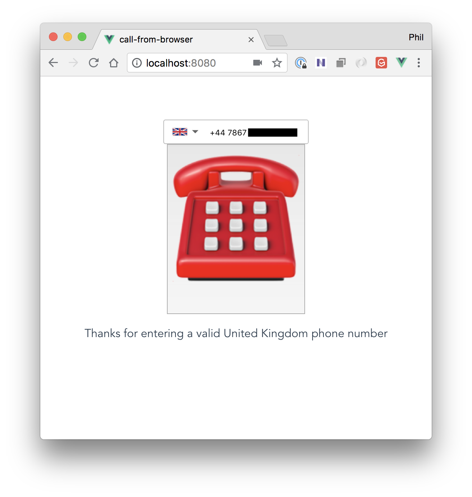
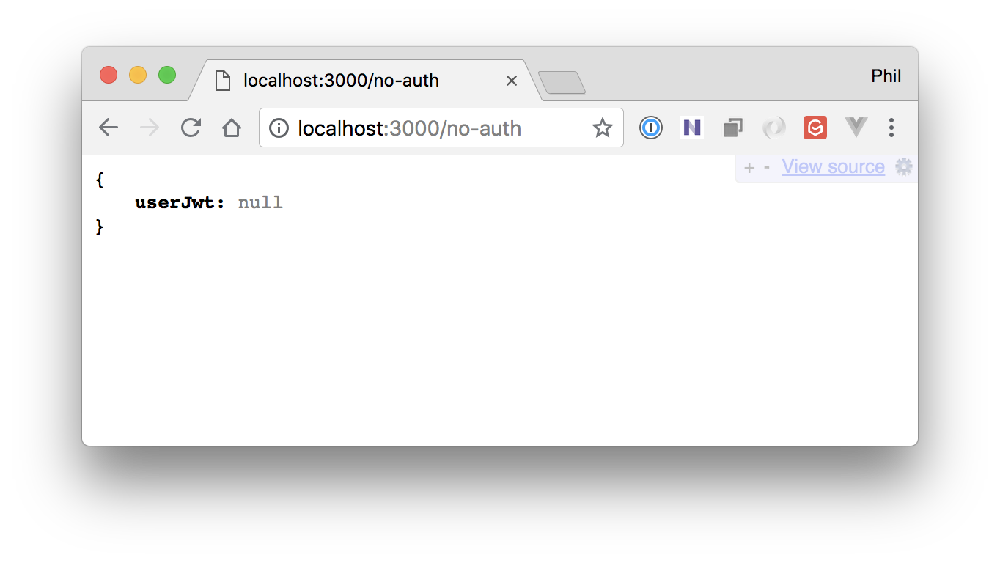
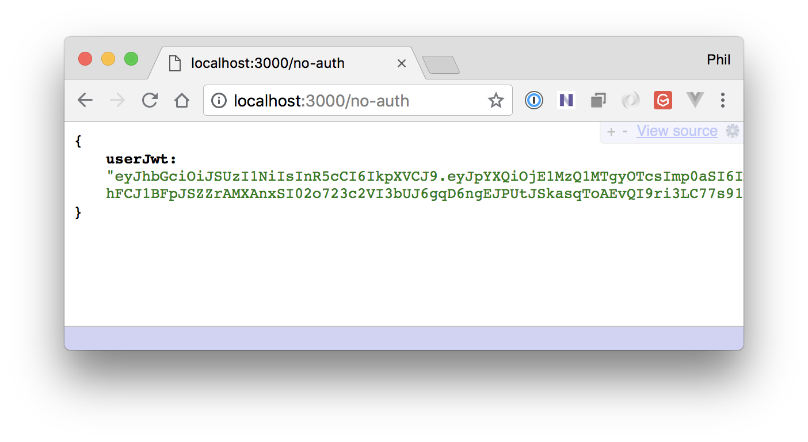
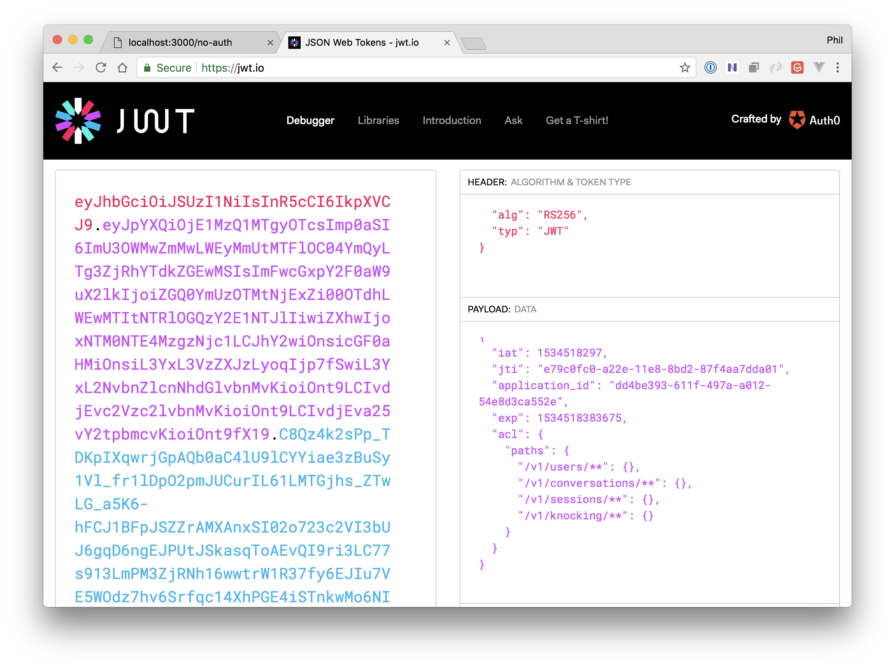
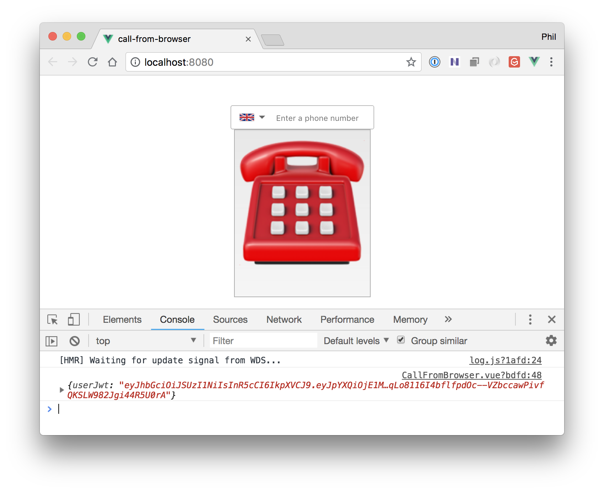
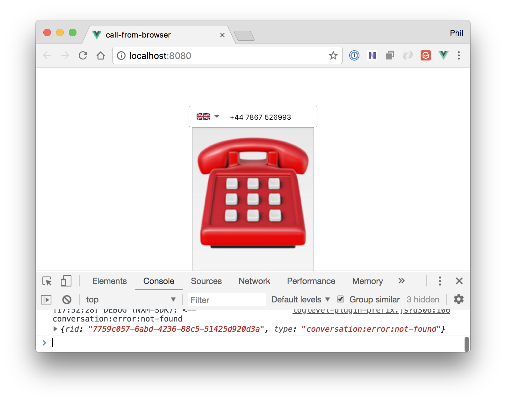

# Making Phone Calls from a Web Browser with Vue.JS and Nexmo In-App Voice

## Overview - what are we going to learn and build

In-App Messaging, In-App Voice, Developer Preview...

Diagram:

1. Load the app
2. App makes a request to the server for a User JWT
3. Create a Conversation client, login to the Nexmo platform using the User JWT
4. Start a phone call from the browser
5. Nexmo recieves the request to make the phone call and makes a request to the Nexmo Application answer_url to understand how to proceed with the call
6. Return a `connect` action to connect the web browser call to a phone


## Before we begin - prerequisites including maybe getting the baseline started code via git

* [Yarn](https://yarnpkg.com/en/docs/install) for package management
* The [Vue CLI](https://cli.vuejs.org/guide/installation.html) for scaffolding out our app and running a dev server
* A [Nexmo account](https://dashboard.nexmo.com/sign-up) to enable us to use the Stitch JavaScript SDK and make phone calls
* The [Nexmo CLI](https://github.com/Nexmo/nexmo-cli#installation) to quickly create and setup a Nexmo application from the command line
* A local tunnel solution such as [Ngrok](https://www.nexmo.com/blog/2017/07/04/local-development-nexmo-ngrok-tunnel-dr/ so that the Nexmo platform can reach a locally running web server). For this blog post we're going to use Ngrok.

With those in place, let's get started.

## Scaffold a new Vue.JS Project

Run the following `vue` command in the terminal and pick the default of `(babel, eslint)` when prompted.

```
$ vue create call-from-browser

# navigate into the newly created Vue project folder
cd call-from-browser
```

TODO: details on what has been created?

We're going to build a `CallFromBrowser` component so let's rename the default `HelloWorld` one that was created.

```sh
mv src/components/HelloWorld.vue src/components/CallFromBrowser.vue
```

With that we're ready to start building the UI.

## Create a Simple Phone Number Input & Dialing Interface

Vue.JS has a strong and growing ecosystem so it makes sense to utilize existing components, if there are any. Luckily, there are a few options and we'll go with the [vue-tel-input component](https://github.com/EducationLink/vue-tel-input) by [Steven Dao](https://github.com/iamstevendao).


Install the component:

```sh
$ yarn add vue-tel-input
```

Now that we have the component to help us validate phone numbers we can add it to the `CallFromBrowser` component. Open `src/components/CallFromBrowser.vue` in a code editor.

Update the `<template>` element as follows:

```xml
<template>
  <main class="call-from-browser">
    <vue-tel-input @onInput="onInput">
    </vue-tel-input>
    <button class="call-control" v-bind:class="{'call-in-progress': callInProgress}"
            v-on:click="controlCallClick"></button>
    
    <p>{{infoMessage}}</p>
  </main>
</template>
```

The template utilises the `<vue-tel-input>` component and sets an `@onInput` handler. We also have a `<button>` that will have a `call-in-progress` class set based on a `callInProgress` property and a click handler that will call a `controlCallClick` method. The template also has a `<p>{{infoMessage}}</p>` that enables us to provide some user feedback via a `data.infoMessage` property that we're just about to define.

Let's next update the contents of the `<script>` tag within the same file.

```xml
<script>
import 'vue-tel-input/dist/vue-tel-input.css'
import VueTelInput from 'vue-tel-input'

export default {
  name: 'CallFromBrowser',
  components: {
      'vue-tel-input': VueTelInput
  },

...
```

This imports the CSS and the component definition for the telephone input component, set the name of the component to `CallFromBrowser` and register the `vue-tel-input` component dependency so it can be used within the template.

The template also relies on a `callInProgress` property so default that to `false`:

```js
  data() {
    return {
      phone: {
        number: '',
        isValid: false,
        country: {}
      },
      infoMessage: "",
      callInProgress: false
    }
  },
```

Next let's set up some properties for data binding and add any methods that are expected to be in place, as show in the template.

```js
export default {
  name: 'CallFromBrowser',
  components: {
      'vue-tel-input': VueTelInput
  },
  
  data() {
    return {
      phone: {
        number: '',
        isValid: false,
        country: {}
      },
      infoMessage: "",
      callStatus: "none"
    }
  },

  methods: {

    onInput({ number, isValid, country }) {
      this.phone.number = number;
      this.phone.isValid = isValid;
      this.phone.country = country;

      if(!isValid) {
        this.infoMessage = "Please enter a valid phone number"
      }
      else {
        this.infoMessage = `Thanks for entering a valid ${this.phone.country.name} phone number`
      }
    },

    controlCallClick() {
    }

  }
}
</script>
```

The `data` function returns a `phone` object that we populate in the `onInput` handler. In that handler we set the phone number that the user has entered into the `vue-tel-input` component and properties representing the validity of the phone number and the country that the number is for.

We also provide the user with some feedback on the phone number validity by setting the `infoMessage` property. Vue data-binding means that the value we set here is reflected in the UI.

A stub `controlCallClick` method is also added to handle the `<button>` being clicked.

A final step in setting up the `CallFromBrowser` component is to add some styling. Replace the existing `<style>` element and contents with the following:

```xml
<style scoped>
.vue-tel-input {
  width: 200px;
  margin: auto;
}

.call-control {
  font-size: 11em; 
}

.call-control:before {
  content: '☎️';
}

.call-control.call-in-progress:before {
  content: '📞'
}
</style>
```

The style sets the default `content` of the `<button>` to be the red telephone emoji (☎️). If the `call-in-progress` class is present, dynamically set if the `callInProgress` property returns `true` then the `content` will instead be a an old-style phone handset emoji (📞).

The final step in getting the basic UI in place is to update `App.vue`.

```xml
<template>
  <div id="app">
    <CallFromBrowser/>
  </div>
</template>

<script>
import CallFromBrowser from './components/CallFromBrowser.vue' to use the new `CallFromBrowser` component.

export default {
  name: 'app',
  components: {
    CallFromBrowser
  }
}
</script>
```

We do this by replacing the `<template>` contents, importing the `CallFromBrowser.vue` component definition and registering the imported component.

We can now run the app by executing `yarn serve`, navigating in a browser to `http://localhost:8080` and trying out entering phone numbers into the `vue-input-tel` component. We'll see the phone number validated at the bottom of the app UI.



## Creating a User JWT to login to the Nexmo Plaform

The Nexmo Stitch JavaScript SDK connects to the Nexmo platform to enable In-App Voice functionality. In order to connect to the Nexmo platform we need to `login` with a valid user authentication JWT (JSON Web Token) for the current application user that defines the user's permissions. To create a User JWT we're going to need to create a few things:

1. a simple server that generates the User JWT that can be retrieved by the `CallFromBrowser` Vue.JS component
2. a Nexmo Application within the Nexmo platform - we can do this using the Nexmo CLI
3. a User within the Nexmo Application for the current web app users

Let's start by creating a simple server. Create a `server` directory, install a few dependencies and create an `index.js` file for the functionality we need.

```sh
$ mkdir server
cd server
yarn init -yp #create package.json for server
yarn add express body-parser cors dotenv nexmo
touch server.js
touch .env # for environment variables
```

For the server we're going to use [Express.js](https://expressjs.com/) with the CORS and body-parser middleware. `dotenv` is used to load in the .env file which itself will contain configuration that we wouldn't want in source control. We've also installed the Nexmo Node.JS library to help with User JWT generation.

Before we look at the server code let's also create the Nexmo Application and the User for that application. We can do this using the Nexmo CLI:

```sh
$ nexmo app:create call-from-browser https://example.com/answer https://example.com/event --keyfile=private.key
```

Running this command will output an application ID. It will also add details to a `.nexmo-app` file. Take the application ID and add it to the `.env` file along with a variable for the `private.key` location:

```
NEXMO_PRIVATE_KEY=private.key
NEXMO_APP_ID=YOUR_APPLICATION_ID
```

The last piece of Nexmo Application setup is to create a user with in the application. It's possible to do this using Nexmo libraries but in this case we'll set up a user using the Nexmo CLI:

```sh
$ nexmo user:create name=demo
```

This command will create the user for the application ID identified within the `.nexmo-app` file. Add and environment variable for the user name to the `.env` file.

```
NEXMO_PRIVATE_KEY=private.key
NEXMO_APP_ID=YOUR_APPLICATION_ID
NEXMO_APP_USER_NAME=demo
```

Now open up `index.js` to add the basic server code:

```js
// Load .env config
require('dotenv').config({
    path: __dirname + '/.env'
});

const Nexmo = require('nexmo');
const express = require('express')
const bodyParser = require('body-parser')
const cors = require('cors')

const app = express()
app.use(bodyParser.json())
app.use(cors())

// endpoint that doesn't authenticate the user
// it will simply return a JWT with every request
app.get('/no-auth', (req, res) => {
    res.json({userJwt: null})
})

app.listen(3000, () => console.log('Example app listening on port 3000!'))
```

In the above code we load in Express and set it up to parse inbound requests as JSON (we'll use this later). We also set Express up to support Cross Origin Resource Sharing (CORS). This is require because the Vue.JS app is running on `localhost:8080` and the JavaScript code running in the browser needs to make a call to this server running on `localhost:3000`, a different port.

You can now run `node index.js` and then access `http://localhost:3000/no-auth` to ensure the endpoint returns the expected JSON.



Now, let's add the code to generate the User JWT to be used with the Nexmo Stitch JavaScript SDK.

```js
const userAcl = {
    "paths": {
        "/v1/users/**": {},
        "/v1/conversations/**": {},
        "/v1/sessions/**": {},
        "/v1/knocking/**": {}
      }
}

// endpoint that doesn't authenticate the user
// it will simply return a JWT with every request
app.get('/no-auth', (req, res) => {
    const jwt = Nexmo.generateJwt(process.env.NEXMO_PRIVATE_KEY, {
        application_id: process.env.NEXMO_APP_ID,
        sub: process.env.NEXMO_APP_USER_NAME,
        exp: new Date().getTime() + 86400,
        acl: userAcl
    })

    res.json({userJwt: jwt})
})
```

The `userAcl` variables provides a set of access rules that are used when creating the JWT along with the application ID, a `sub` for the name of the user and a `exp` as an expiry time for the JWT.

Restarting the node `index.js` processing and accessing `http://localhost:3000/no-auth` will show a real JWT having been generated.



It can sometimes be handy to take a look at [JWT Debugger](https://jwt.io/#debugger-io) to check the contents of your JWT.



## Fetching the User JWT from the Web Browser

With the JWT generation in place we can move back to the client to first retrieve the User JWT that we not create on the server.

Vue.JS has various [life cycle hooks](https://vuejs.org/v2/guide/instance.html#Lifecycle-Diagram). We'll retrieve the JWT within the `created` hook. To do this define a `created` function within the `CallFromBrowser` definition.

```js
    ...

      callInProgress: false
    }
  },

  created() {
    fetch('http://localhost:3000/no-auth')
      .then(response => {
        return response.json();
      })
      .then(json => {
          console.log(json)
      })
      .catch(error => {
        console.error(error)
      })
  },
```

Ensure your Vue.JS development server is still running (run `yarn serve` from within the `call-from-browser` directory if not) navigate to `http://localhost:8080` and open up your developer tools to check the console and make sure the User JWT us logged.



## Adding the Nexmo Stitch JS SDK for In-App Voice

With the User JWT in the client we can move to installing the Nexmo Stitch JavaScript SDK:

```sh
cd .. # navigate up from the 'server' directory
yarn add nexmo-stitch
```

Next, include the SDK within the `CallFromBrowser.vue` component and import the `ConversationClient` object definition:

```xml
<script>
import 'vue-tel-input/dist/vue-tel-input.css'
import VueTelInput from 'vue-tel-input'

import ConversationClient from 'nexmo-stitch'
```

Once we have the required definition included we need to create a new instance of the `ConversationClient` and `login`. We'll do this after retrieving the User JWT:

```js
  created() {
    fetch('http://localhost:3000/no-auth')
      .then(response => {
        return response.json();
      })
      .then(json => {
        this.conversationClient = new ConversationClient({debug: false})

        return this.conversationClient.login(json.userJwt)
      })
      .then(app => {
        this.app = app

        // When the active member (the user) makes a call
        // keep a reference to the Call object so we can
        // hang up later
        this.app.on("member:call", (member, call) => {
            this.call = call
        });

        // Keep track of call status so we know how to
        // interact with the call e.g. hangup
        this.app.on("call:status:changed", (call) => {
            this.callInProgress = ['machine', 'timeout', 'unanswered', 'rejected', 'busy', 'failed', 'completed']
                                    .indexOf(call.status) === -1
        })
    })
    .catch(error => {
        console.error(error)
    })
  },
```

After the login Promise resolves we receive a reference to a representation of the Nexmo Application via the `app` variable. We keep a reference of that app for future use (`this.app`) and also bind to two events on the app.

`member:call` is triggered when the active user makes a call in which case we store a reference to the current call with `this.call`.

We also bind to `call:status:changed` to keep track of the call status. Within the event handler we updated the `callInProgress` property based on the call status. If the call is in any of the final states then the call is not in progress. Otherwise, the call status is in progress. These states will be reflected in the `<button>` in the template.

## Making a Phone Call from the Web Browser

The final thing we need to do in the client - before we make one last update to the server and complete the app - is handle the user click on the `<button>`.

```js
        ...
    },

    controlCallClick() {
      if(this.callInProgress) {
        this.call.hangUp()
      }
      else if(this.phone.isValid) {
        this.app.callPhone(this.phone.number)
      }
    }
```

If there is not call in progress and the user has entered a valid phone number this should trigger the call. If there is an active call this should hangup the call. We add this functionality to the `controlCallClick` function. In both cases we call the appropriate function on the `this.call` reference we set in the `member:call` event handler.

With all the client-side functionality in place you can enter a valid phone number, click the call button and you'll then see an error in the console that comes from the Nexmo platform

> conversation:error:not-found



When a call is initiatited or received by the Nexmo platform it makes an HTTP request to the `answer_url` for the relevant application. The server that recieves that HTTP request must return a Nexmo Conversation Control Object (NCCO) that instructs Nexmo how to proceed with the call.

## Connecting the Browser to a Phone

Back in `server/index.js` add an `/answer` endpoint to hande the `GET` request from the Nexmo platform:

```js
app.get('/answer', (req, res) => {
    const ncco = [{
        "action": "connect",
        "from": process.env.NEXMO_FROM_NUMBER,
        "endpoint": [{
            "type": "phone",
            "number": req.query.to
        }]
    }]

    res.json(ncco)
})
```

If you have a Nexmo phone number you should add a `NEXMO_FROM_NUMBER` entry to the `.env` file so that recipient of phone calls see a number on their inbound call. Otherwise, it may come up as a "Private Number" or "Unknown".

Restart the Node process for the servers so the server is running with the updated code.

Finally, we need to make it possible for the Nexmo platform to reach the answer URL. To do this use Ngrok to create a local tunnle to `localhost:3000`.

```sh
$ ngrok http 3000
```

And update the `answer_url` for your Nexmo Application to utilise the Ngrok tunnel using the Nexmo CLI.

```
$ nexmo app:update NEXMO_APP_ID "call-from-browser" https://4ca73ac6.ngrok.io/answer https://4ca73ac6.ngrok.io/event
```

Head back into the Vue.JS app in the browser, enter a phone number and click the button to make an outbound call from your web brower.

## Conclusion - summarize what's been achieved and learned


## Where next - What other resources are relevant and interesting to the reader